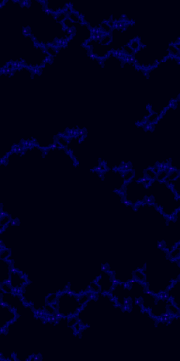
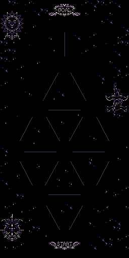
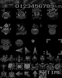

# dynami-tracer

# Memory map

## Compressed data

Offset | Image | Comment
--- | --- | ---
242C0-2741B |  | Tiles Length: x4000
2741C-27B75 |  | Tiles Length: xA00
27B76-27EB7 | | ? Length: x800
3E200-3E32A | | Text including default character names Length: x38D
70000-7002E | | ? Length: x20A
78E20-7AF1A |  | Tiles Length: x4A00
A0000 | | 10 pointers
A0020-A0396 |  | Tile map Length: x1000
A0397-A080F |  | Tile map Length: x1000
A0810-A08BA |  | Tile map Length: x800
A08BB-A1D3F |  | Tiles Length: x2800
A1D40-A245C |  | Tiles Length: x2000
A245D-A257A |  |  Length: xD00
A257B-A26DE |  |  Length: x200
A26DF-A2B78 |  |  Length: x1800
A2B79-A3B27 |  | Tiles Length: x1400
A3B28-A3C02 |  |  Length: x240